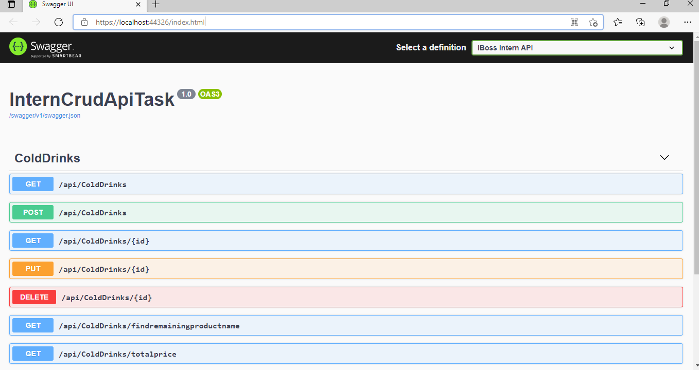

# IBoos Intern Technical Assignment

In this repository I want to give a plain starting point at how to build a WebAPI with ASP.NET Core Web API.

This repository contains a controller which is dealing with Drinks Items. You can GET/POST/PUT/PATCH and DELETE them.

Hope this helps.

See API Docs From swagger:

## Versions

``` https://localhost:44326/index.html ```


